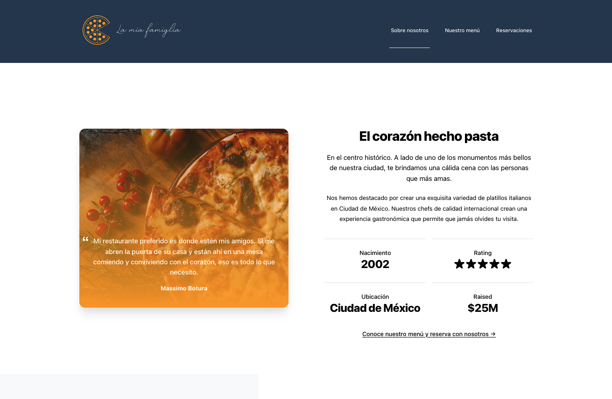

# PROYECTO 4: Aplicación "Restaurante"

## **ÍNDICE**

* [1. Intro](#1-intro)
* [2. Demo](#2-demo)
* [3. ¿Qué construirás?](#3-qu%C3%A9-construir%C3%A1s)
* [4. Objetivos de Aprendizaje](#4-objetivos-de-aprendizaje)
* [5. Requisitos](#5-requisitos-y-entregables)
* [6. Criterios de evaluación](#6-criterios-de-evaluaci%C3%B3n)
* [7. Entregas](#7-entregas)

****

## 1. Intro

Uno de los sectores que más han adaptado sus negocios al mundo digital es la industria restaurantera.

Con esto en mente, al ser tan competitiva, es importante considerar los medios digitales para dar mayor información y confianza sobre sus negocios.

Existen diversas propuestas de inmersión tecnológica como:

- Información y blogs
- Sistemas de reserva
- Pagos sin contacto directo
- "Delivery"
- Tableros para ordenar directamente a cocina
- Códigos QR

A pesar de haber mucha variedad de propuestas, el primer paso importante es crear un espacio para los menús, dirección, historia y horarios, a cualquier persona interesada en visitarlos y/o reservar con ellos.

****

## 2. Demo

Puedes entrar a ver el demo en este link: https://infallible-euler-18a8a2.netlify.app/

La idea es inspirarte con esta demostración de producto y lo que podrías construir. 

**No es necesario realizar el mismo producto**, sin embargo, revisa las diferentes características.

****

## 3. ¿Qué construirás?

Este proyecto está enfocado en construir una aplicación web para un restaurante.

Lo que deberás incluir como requisitos mínimos será:

- Una sección o página sobre información principal del restaurante
- Una sección de formulario de contacto
- Una sección de datos de ubicación y correo electrónico

Como características opcionales:

- Un componente que permita reservar una mesa en una hora y fecha específica para un usuario
- Un componente que incluya el menú completo del restaurante
- Adaptado a móviles
- Un blog que incluya un artículo

Para la gestión de datos, te recomendamos utilizar `Cloud Firestore` de Firebase. 

****

## 4. Objetivos de aprendizaje

El objetivo principal de este proyecto es desarrollar una aplicación web utilizando React y, opcionalmente, Firebase.

Aplicarás:

- `create-react-app` como el generador base de la aplicación
- Componentes bajo "Hooks"
- CSS para el aspecto visual de componentes
- Cloud Firestore para el manejo de datos

****

## 5. Requisitos y entregables

Usa esta lista para saber los requisitos mínimos del proyecto:

### GENERAL

Realizarse de manera individual:

### UI 30%
- [ ] Vista en móviles 10%.
- [ ] Aplicar en todo el sitio HTML semántico de estándar no.5 (HTML5). 10%
  - [ ] Header 5%
  - [ ] Footer 5%
- [ ] Aplicar tipos de selectores en CSS. 10%

### REACT 40%
- [ ] Uso de props 10%
- [ ] Uso de hooks `useState` 10%
- [ ] Sección de reserva 10%
- [ ] Formulario para reservar 10% 

### ALMACENAMIENTO 10%
- [ ] FireBase(se puede utilizar cualquier otra herramienta Azure/AWS) 10%
* Guardado de datos de las reservaciones 

### DESPLIEGUE Y CONTROL DE VERSIONES 10%
- [ ] Crear un repositorio en GitHub. 5%
- [ ] Despligue haciendo "npm build" 5%.

### ENTREGA A TIEMPO 10%
- [ ] Entregar URL en plataforma antes de la fecha límite. 10%

### OPCIONAL Blog con un artículo.
### OPCIONAL Sección de conócenos.

****

## 6. Criterios de evaluación

A partir de los requisitos, tu % estará definido de esta forma:

| ÁREA       | % DEL TOTAL |
| ------------- |:-------------:|
| UI      | 30%     |
| REACT      | 40%     |
| ALMACENAMIENTO      | 10%     |
| DESPLIEGUE / VERSIONADO| 10%      |
| ENTREGA A TIEMPO | 10%      |

****

## 7. Entregas

- **Definición de fechas.** Habla con tus coaches sobre el periodo de entregas del proyecto.

- **Cumple con los requisitos y entregables.** En caso de que no logres cumplir con todos, se te asignará un progreso proporcional a lo que lograste. Lo importante es que entregues siempre tu proyecto.
